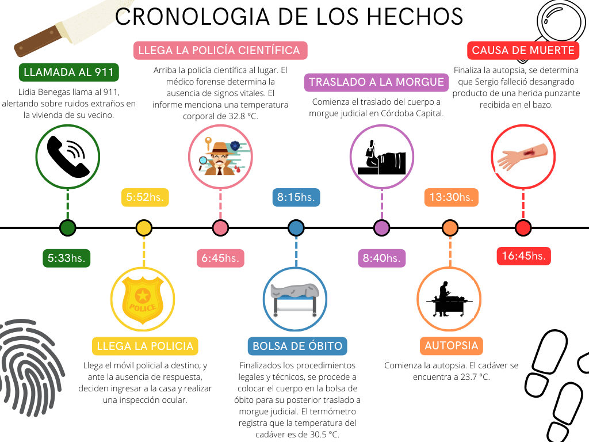

```{r, include=FALSE, echo=FALSE}
#| label = Parametros del informe
modo_prod=FALSE
knitr::opts_chunk$set(fig.align = "center")
```

# Introducción

Sumergirse en el mundo de la estadística puede llevarnos a lugares
inesperados, desafiando nuestras percepciones y llevándonos a explorar
terrenos desconocidos. En esta ocasión, nos sumergimos en un caso
peculiar que fusiona el rigor analítico con el misterio de una escena
del crimen.

Nuestra historia se centra en Guido, un apasionado estudiante de
estadística cuyo amor por la resolución de enigmas lo llevó desde las
aulas universitarias hasta las intrigantes calles de Córdoba.

Sin embargo, la emoción de seguir su vocación se ve eclipsada por un
oscuro suceso. En una madrugada envuelta en sombras, la unidad de
trabajo de Guido es convocada de manera urgente para investigar un
crimen recién perpetrado en Salsipuedes.

En medio del desorden, muebles destrozados, utensilios de cocina
esparcidos y, en el centro de todo, el cuerpo inerte de Sergio
Contreras, bañado en un charco de sangre. Ante esta escena, Guido se
enfrenta a un desafío crucial: determinar la hora en que se produjo la
muerte.


# Objetivos

El objetivo principal de este informe es utilizar métodos estadísticos
con enfoque bayesiano para estimar con precisión la hora de muerte de
Sergio Contreras. A través del estudio de la temperatura corporal
postmortem y la aplicación de modelos lineales, buscaremos proporcionar
una estimación confiable del momento en que ocurrió el deceso. Además,
nuestro objetivo secundario es presentar los resultados de manera clara
y concisa, demostrando un dominio completo del contenido y garantizando
así la obtención de una calificación sobresaliente (10😉) en la
evaluación del informe.

# Metodología

A través del análisis de la temperatura corporal, ecuaciones
diferenciales y conceptos matemáticos podremos descifrar el objetivo
planteado.

Sabemos que la temperatura del cuerpo de Sergio satisface la siguiente
ley: $$\frac{dT(t)}{dt}=r[T_{amb}-T(t)]$$ donde:

-   $T_{amb}$ es la temperatura ambiente (un valor fijo y conocido),

-   $r$ es una constante y

-   $T(t)$ es la función (en principio desconocida) que describe la
    temperatura del cuerpo en función del tiempo.

Se puede demostrar que Una función que satisface esa ecuación es
$T(t)=T_{amb}+(T_i-T_{amb})e^{-rt}$

$$\frac{dT(t)}{dt}=\frac{d}{dt}(T(t)=T_{amb}+(T_i-T_{amb})e^{-rt})=$$
$$=(T_i-T_{amb})e^{-rt}(-r)=-r(T_i-T_{amb})e^{-rt}=$$
$$=-r(T_i-T_{amb})e^{-rt}+rT_{amb}-rT_{amb}=$$
$$=-r[(T_i-T_{amb})e^{-rt}+T_{amb}]+rT_{amb}=$$

$$=-r[T(t)-T_{amb}]=r[T_{amb}-T(t)]$$ donde:

-   $T_i$ la temperatura a la que está inicialmente el cuerpo de Sergio.

# Desarrollo

Para averiguar que indica la constante r, y que valores son coherentes,
graficamos la función anterior para distintos valores de $r$, sabiendo
que la temperatura del ambiente es $23°C$ y la temperatura al momento de
la muerte de Sergio es $37°C$.

```{r, echo=FALSE, error=FALSE, warning=FALSE}
# Carga de paquetes
library(ggplot2)
library(gridExtra)
library(rstan)
library(bayesplot)
library(grid)
library(StanHeaders)
library(ggthemes)
library(patchwork)
library(kableExtra)
library(dplyr)
# Paletas de colores
colores1 <- c("#da91d5","#663364", "#897289", "purple", "#7e0b7d", "#9e3d9d")
colores2 <- c("#897289", "#897289", "#897289", "#663364", "#897289", "#663364")

```

```{r echo=FALSE, error=FALSE, warning=FALSE}
valores_r = c(0.1,0.15, 0.3, 0, -0.1, -0.3, -1)
temp_desc <- function(valores_r){
  f <- c()
  r <- c()
  t <- seq(0, 24, length.out=200)
  for(i in 1:length(valores_r)){
    f <- c(f, 23+14*exp(-valores_r[i]*t))  
    r <- c(r,rep(valores_r[i], time = 200))
  }
  df <- data.frame(f, tiempos = rep(t, time = length(r)), r=factor(r))
  
g1 <- ggplot(data = df) +
  aes(x = tiempos, y = f, color = r) +
  geom_line() +
  ylim(c(20, 60)) +
  scale_x_continuous(breaks = 0:24) +
  labs(
    x = "Hora post mortem", 
    y = "Temperatura corporal",
    caption = "Gráfico 1: Temperatura corporal post mortem para distintos valores de r"
  ) +
  scale_color_manual(
    values = c("#982597", "#897289", "purple", "#7e0b7d", "#af95d2","black", "#5f3ae0")
  ) +
  #theme_minimal() +  # Utilizar un tema minimalista para una apariencia más limpia
  theme(
    plot.caption = element_text(hjust = 0.5)
  )+theme_few()
  g1
}
temp_desc(valores_r)
```

Sabemos que la temperatura corporal eventualmente alcanza el equilibrio
térmico con el ambiente, por lo que no desciende más de $23°C$. Además,
al observar los gráficos, se puede deducir que $r$ representa la rapidez
con la que la temperatura corporal disminuye hasta igualarse con la del
entorno. Por este motivo, el valor de $r$ no puede ser negativo, ya que
en estos casos la temperatura aumenta y no es coherente en este
problema.

En términos generales, los cadáveres pierden $2 °C$ de temperatura
durante la primera hora después del deceso. Luego pierde alrededor de
$1.5 °C$ por hora durante las siguientes 12 horas y, en las horas
posteriores, la temperatura desacelera su descenso hasta llegar a la
temperatura ambiente, aproximadamente 24 hs luego de la muerte.

Por lo tanto, llegamos a la conclusión de que $0.15$ es un valor lógico
para $r$, ya que en las primer hora vemos una disminución de $1.95°C$ en
la temperatura corporal, luego, para las siguientes 12 horas la
temperatura descendera en razón de entre $1°C$ y $1.5°C$ por hora.
Posteriormente la temperatura seguirá descendiendo de manera más lenta
hasta llegar a la temperatura ambiente aproximadamente 24hs despues de
la muerte.

Para responder nuestro objetivo tendremos en cuenta las siguientes
consideraciones: En lugar de considerar la temperatura del cuerpo, se
considerará la diferencia entre la temperatura del cuerpo y la
temperatura ambiente $(T-T_{amb})$. Además, se llamará $T_{diff}$ a la
diferencia entre la temperatura inicial del cuerpo y la temperatura
ambiente $(T_i-T_{amb})$.

$$T(t)-T_{amb}=T_{diff}e^{-rt}$$

Para linealizar la ecuación aplicamos logaritmo natural a nuestra nueva
variables $T(t)-T_{amb}$ $$ln(T(t)-T_{amb})=ln(T_{diff})-rt$$ Mostramos
esto graficamente utilizando $r = 0.15$:

```{r,  echo=FALSE}
r = 0.15
t <- seq(0, 24, length.out=200)
f <- 14*exp(-r*t)
ln_f <- log(f)
df2 <- data.frame(f = c(f,ln_f),t =c(t,t), funcion = rep(c("f", "ln_f"), each = 200))
g4 <- ggplot(data = df2) +
  aes(x = t, y = f, color = funcion) +
  geom_line() +
  labs(
    x = "Hora post mortem", 
    y = "Grados centígrados", 
    caption = expression("Gráfico 2: Comparación de las funciones " * T(t) - T[amb] * " y " * log(T(t) - T[amb])),
    color = "Función"  # Cambia el título de la leyenda a mayúsculas
  ) +
  scale_color_manual(
    values = c("#5f3ae0", "#7e0b7d"),
    labels = c(expression(T(t) - T[amb]), expression(log(T(t) - T[amb])))
  ) +
  #theme_minimal() +  # Utilizar un tema minimalista para una apariencia más limpia
  theme(
    plot.caption = element_text(hjust = 0.5),
    legend.title = element_text(face = "bold"),  # Poner el título de la leyenda en negrita
    legend.text = element_text(size = 10)        # Ajustar el tamaño del texto de la leyenda
  )+
  theme_few()
g4
```

El intercepto de la función logaritmo de $T(t)-T_{amb}$ es
$ln(T_{diff})=2.639$ , lo que indica que la diferencia entre la
temperatura corporal y la temperatura ambiente en el momento de la
muerte es $e^{2.639}°C=14°C$. La pendiente es $-r=-0.15$, esto significa
que a medida que aumenta una hora, el valor esperado del logaritmo de la
diferencia entre la temperatura corporal y la temperatura ambiente
disminuye en $0.15°C$.

Para resolver nuestro objetivo proponemos ajustar un modelo lineal
normal, en el que tomaremos como variable explicativa las horas que
pasaron desde la muerte. A continuación se presentan los hechos
transcurridos en la noche del fallecimiento de Sergio para ingresar
estos datos en el modelo.

 Para deducir un
prior para el intercepto suponemos que la verdadera función que describe
el descenso de temperatura post mortem ( *algor mortis* ) es aquella que
presentamos con $r=0.15$. Luego, tomamos las medidciones de las 6:45 am
y 8:15 am, las proyectamos a traves de nuestra función y obsevarmos
cuantas horas transcurrieron desde la muerte.

```{r,  echo=FALSE}
valores_r = c(0.15)
f <- c()
r <- c()
t <- seq(0, 12, length.out=100)
for(i in 1:length(valores_r)){
  f <- c(f, 22+15*exp(-valores_r[i]*t))
  r <- c(r,rep(valores_r[i], time = 100))
}
  
df <- data.frame(f, tiempos = rep(t, time = length(r)), r=factor(r))

g1 <- ggplot(data = df) +
    aes(x = tiempos, y = f) +
    geom_line(color = "#5f3ae0") +
    ylim(c(20, 40)) +
    scale_x_continuous(breaks = seq(0, 12, by = 1), labels = seq(0, 12, by = 1)) +
    labs(
      x = "Hora post mortem",
      y = "Temperatura corporal",
      caption = "Gráfico 3: Temperatura corporal post mortem para r = 0.15"
    ) +
    # Añadir líneas horizontales
    geom_hline(yintercept = 32.8, linetype = "dashed", color = "#7e0b7d") +
    geom_hline(yintercept = 30.5, linetype = "dashed", color = "#af95d2") +
    geom_vline(xintercept = (log((32.8-22)/15)/-0.15), linetype = "dashed", color = "#7e0b7d") +
    geom_vline(xintercept = (log((30.5-22)/15)/-0.15), linetype = "dashed", color = "#af95d2") +
  theme_few()+
  theme(plot.caption = element_text(hjust = 0.5),
          legend.title = element_text(face = "bold"),
          legend.text = element_text(size = 10) )
print(g1)
  #log((32.8-22)/15)/-0.15
  #log((30.5-22)/15)/-0.15)

```

Viendo esto sabemos que a las 6:45 am, horario en el que se constató una
temperatura corporal post mortem de $32,8°C$ , el cuerpo deberia llevar
$2.19$ horas sin vida (lo que equivale a 2 hs y 12 minutos) y a las 8:45
am, horario en el que se constató una temperatura post mortem de
$30,5°C$ , el cuerpo de Sergio llevaba 3,786 horas sin vida (lo que
equivale a 3 hs y 47 minutos ). Por lo expuesto pensamos que la hora de
muerte puede estas alrededor de las 4:30 am.

En este razonamieto no tenemos en cuenta la temperatura constatada a las
13:30 hs ya que suponemos que, al llegar a la morgue (9:55 am), el
cuerpo fue resguardado en cámaras frigoríficas hasta la hora de la
autopsia , por lo que su temperatura dismunuyó más rápido que el
comportamiento natural.

Planteamos el modelo:

$Y_i| \beta_0, \beta_1, \sigma \sim N (\mu_i, \sigma)$

$\mu_i = \beta_0 + \beta_1t$ $\beta_0 \sim N(\mu=2.7, \sigma=0.05)$

$\beta_1 \sim N(\mu=-0.13, \sigma_2=0.03)$

$\sigma \sim N^+ (\theta_2=1)$

Donde:

-   $Y_i=log(T(t)-T_{amb})$

-   $\beta_0$: es el intercepto de la recta

-   $\beta_1$: es la pendiente de la recta

-   $\sigma$: desvío estándar de $Y_i$

-   $t$: horas transcurridos desde la muerte de Sergio Contreras.

Hacemos el supuesto de que los parámetros son independientes, por lo que
podemos postular un prior marginal para cada uno. Además pensamos que la
muerte de Sergio ocurrió en un horario cercano al ya mencionado
(4:30am), y tendremos en cuenta esto para deducir nuestras
distribuciones a priori.

Para definir el prior de $\beta_0$ sabemos que la temperatura habitual
del cuerpo humano oscila como mucho entre $36°C$ y $38°C$, y la
temperatura ambiente en Salsipuedes esa noche fue de $22°C$, pensamos
que $\beta_0$ puede variar aproximadamente entre $log(38 - 22)=2.773$ y
$log(36 - 22)=2.639$. Por lo que nuestro prior para este parámetro es
una distribución normal con media igual a $2.7$ y desvío $0.05$.

Para definir el prior de $\beta_1$ asumimos que la pendiente no puede
ser positiva, ya que la diferencia entre la temperatura de un cuerpo sin
vida y la temperatura ambiente irá disminuyendo conforme pasen las horas
(a menos que lo esten cremando🤭). Por lo tanto, asumimos un prior de
$\beta_1$ con distribución Normal con media $\mu = -0.15$ y desvío
$\theta_1 = 0.04$.

Por último como $\sigma$ no puede tomar valores negativos, decidimos
postular una distribución Media Normal Positiva con desvío
$\theta_2 = 1$ porque pensamos que el logaritmo de las diferencias de
temperaturas pueden estar como mucho entre 0 y 3.

Mostramos graficamente los prior mencionados:

```{r,  echo=FALSE}
t <- seq(from = -1, to = 24, length.out = 200)
muestras_bo = rnorm(200,2.7, 0.05)
muestras_b1 = rnorm(200,-0.15, 0.04)


df= data.frame(muestras_bo,muestras_b1)

df_aux <- data.frame(b0=rep(muestras_bo, each=200), 
                     b1=rep(muestras_b1, each=200),
                     tiempo=rep(t, times=200),
                     curva=factor(rep(1:200, each=200)))
df_aux$tdt <- exp(df_aux$b0+df_aux$b1*df_aux$tiempo)+22

tdt_graf <- ggplot(df_aux)+
  aes(x = tiempo, y = tdt, group = curva)+
  geom_rect(aes(ymin=36, ymax=38, xmin=-1, xmax=24),fill = "purple", alpha=0.01)+
  geom_line(alpha = 0.1, color = "gray2")+
  theme(legend.position = "none")+
  labs(x = expression("Horas desde las 4:30am"), y = expression(T(t)))+
  geom_vline(xintercept = 0, linetype = "dashed", color = "#7e0b7d")+
  scale_x_continuous(breaks = seq(0, 24, by = 2), labels = seq(0, 24, by = 2)) +
  scale_y_continuous(breaks = seq(20, 50, by = 2), labels = seq(20, 50, by = 2))+
  theme_few()
#tdt_graf

valores_rectas=muestras_bo + muestras_b1*t
sigma = abs(rnorm(200,0,1))

# Crear un rango para t

y <- seq(from = 0, to = 3, length.out = 200)
#df2 <- data.frame(t, y)

g <- ggplot(df, aes(x = t, y = y)) +
  geom_point(alpha = 0)+
  labs(
    x = expression("Horas desde las 4:30am"),
    y = expression( Log( T(t) - T[amb] ) ),
    #caption = expression("Gráfico 3: Priors para beta_0 y beta_1")
  ) + # TODO: Poner expresión
  geom_abline(intercept = muestras_bo, slope = muestras_b1, alpha = 0.1, color = "gray3") +
  coord_cartesian(xlim = c(-2, 24), ylim = c(0, 3))+  
  geom_vline(xintercept = 0, linetype = "dashed", color = "#7e0b7d")+
  scale_x_continuous(breaks = seq(0, 24, by = 2), labels = seq(0, 24, by = 2)) +  # Añade valores al eje x
  scale_y_continuous(breaks = seq(0, 3, by = 0.5), labels = seq(0, 3, by = 0.5)) +  # Añade valores al eje y
 theme(plot.caption = element_text(hjust = 0.5))+
  theme_few()
# Mostrar el gráfico
g+tdt_graf+plot_annotation(caption = "Gráfico 4: Priors")&
  theme(plot.caption = element_text(hjust = 0.5))

```

Basandonos en los priors mencionados y el supuesto de parámetros
independientes, podemos obtener la distribución predictiva a priori a
través de muestras. Para realizar esto se toman valores puntuales de
$t$.

```{r,  echo=FALSE}
generar_datos <- function(t) {
  muestras_bo <- rnorm(200, 2.7, 0.05)
  muestras_b1 <- rnorm(200, -0.15, 0.04) #trampa
  sigma <- abs(rnorm(200, 0, 1))
  mu <- muestras_bo + muestras_b1 * t
  y_pred <- rnorm(200, mu, sigma)
  return(data.frame(t = t, y_pred = y_pred))
}

tiempos <- c(0, 6, 12, 24)

df_muestras <- data.frame()

for (t in tiempos) {
  df_muestras <- rbind(df_muestras, generar_datos(t))
}

ggplot(df_muestras, aes(x = y_pred)) +
  geom_histogram(bins = 20, fill = "#897289", color = "black", alpha = 0.7) +
  facet_wrap(~ t, nrow = 2, scales = "fixed") +  # Crear facetas con dos filas
  labs(
    x = "Predicciones",
    y = "Frecuencia",
    title = "Distribución de las predicciones para diferentes tiempos",
    caption = "Gráfico 5: Histograma de Y predicho para t = 0, 6, 12 y 24"
  ) +
  scale_x_continuous(breaks = seq(floor(min(df_muestras$y_pred)),
                                  ceiling(max(df_muestras$y_pred)), by = 1))+  # Añadir cortes de a 1 en el eje x
  theme_few()+
  theme(plot.caption = element_text(hjust = 0.5),
          legend.title = element_text(face = "bold"),
          legend.text = element_text(size = 10) )
```

En el gráfico 5 podemos apreciar las distribuciones a priori de la
variable respuesta $Y_i=log(T(t)-T_{amb})$ a las 0, 6, 12 y 24 horas
luego de la muerte. Observamos que los valores comienzan centrados en
aproximadamente $3$ y, mientras aumenta el tiempo post mortem, comienzan
a "retroceder" hasta centrarse en valores entre $-1$ y $0$. Aunque estos
valores no nos digan mucho, si analizamos su equivalencia en temperatura
corporal en el tiempo $t$, lo que estamos diciendo es que al momento de
la muerte ($t=0$) las temperaturas corporales predichas a priori tienen
una media de $37,4°C$ y, mientras aumenta el tiempo post mortem,
comienzan a disminuir hasta centrarse en $22,5°C$. Podemos observar
mejor esto en la siguiente tabla:

```{r}
medias <- c(mean(df_muestras$y_pred[df_muestras$t==0]),
            mean(df_muestras$y_pred[df_muestras$t==6]),
            mean(df_muestras$y_pred[df_muestras$t==12]),
            mean(df_muestras$y_pred[df_muestras$t==24]))
temp <- round(exp(medias)+22, 3)
df_tabla <- data.frame(tiempos, round(medias, 3),temp)
colnames(df_tabla) <- c("Tiempo post mortem", "Media de Y predicho", "Temperatura corporal predicha promedio")
kable(df_tabla) %>% 
  kable_styling() %>% 
  footnote(general = "Tabla 1: temperatura corporal predicha según tiempo", general_title = "")
#TODO: sacar grid arrange y agregar caption en uno de lo s dos graficos
```
Utilizando la estadística bayesiana, podemos actualizar nuestras creencias a priori a medida que obtengamos nueva evidencia. Aplicaremos modelos lineales normales bayesianos para estimar la hora de muerte de Sergio Contreras. Estos modelos nos ayudarán a relacionar la temperatura corporal con el tiempo transcurrido desde la muerte.

Para la primer parte de esta sección tendremos en cuenta la información recolectada hasta las 7 de la mañana. A través de esta, calcularemos nuestros posteriors y mediante el uso de ellos, obtenemos una estimación de la hora aproximada en la que Sergio abandonó la vida.

```{r,  echo=FALSE}
#Modelo para un dato
if(modo_prod){
  N <- 1
  y <- array(log(32.8-22),dim=1)
  x <- array(1.2,dim=1)
  stan_data <- list(N=1,x=x,y=y)
  stan_model <- stan( 
      file ="modelo_tp.stan", 
      chains = 4,          # Cantidad de cadenas
      warmup = 100,
      data = stan_data,
      model_name = "modelo_tp",
      seed = 12119       # Para que el resultado sea reproducible
  )
  save(stan_model, file="modelo1.RData")
}
load("modelo1.RData")
stan_model
```


```{r,  echo=FALSE}
color_scheme_set(colores2)
hist1 <- mcmc_hist(
  stan_model,
  pars = c("beta0", "beta1", "sigma"),
  facet_args = list(nrow = 3))+
  scale_color_manual(values = c("#897289"))+
  labs(caption = "Gráfico 6: Distribuciones de los parametros del posterior con una sola observación")+
  theme_few()+
  theme(plot.caption = element_text(hjust = 0.5))
hist1
```
En el gráfico 6, vemos que las distribuciones a priori se modifican muy levemente, esto era de esperarse ya que solo tenemos un dato.
A continuación observamos las rectas estimadas a posteriori para la $log(T(t)-T_{amb})$ y para $T(t)$.

```{r,  echo=FALSE}
set.seed(511) 
t= seq(-1,24, length.out=200)
# Filtrar 200 filas aleatorias
df_sampled <- df_draws_1[sample(nrow(df_draws_1), 200), ]
posterior1= ggplot() +
  labs(
    x = expression("Horas desde las 4:30am"),
    y = expression( Log( T(t) - T[amb] ) ))+
  geom_abline(intercept = df_sampled$beta0, slope = df_sampled$beta1, alpha = 0.1, color = "grey3") +
  geom_vline(xintercept = 0, linetype = "dashed", color = "#7e0b7d")+
  coord_cartesian(xlim = c(0, 24), ylim = c(0, 3))+  
  scale_x_continuous(breaks = seq(0, 24, by = 2), labels = seq(0, 24, by = 2)) +  # Añade valores al eje x
  scale_y_continuous(breaks = seq(0, 3, by = 0.5), labels = seq(0, 3, by = 0.5)) +
  geom_point(aes(x = 1.2, y = 2.3795), fill = "#FF00FF", color = "black", size = 3, shape = 21)+
  theme(plot.caption = element_text(hjust = 0.5))+
  theme_few()

df_aux <- data.frame(b0=rep(df_sampled$beta0, each=200), 
                     b1=rep(df_sampled$beta1, each=200),
                     tiempo=rep(t, times=200),
                     curva=factor(rep(1:200, each=200)))
df_aux$tdt <- exp(df_aux$b0+df_aux$b1*df_aux$tiempo)+22

tdt_graf <- ggplot(df_aux)+
  aes(x = tiempo, y = tdt, group = curva)+
  geom_rect(aes(ymin=36, ymax=38, xmin=-1, xmax=24),fill = "purple", alpha=0.01)+
  geom_line(alpha = 0.1, color = "gray2")+
  theme(legend.position = "none")+
  labs(x = "Horas desde las 4:30am", y = expression(T(t)))+
  geom_vline(xintercept = 0, linetype = "dashed", color = "#7e0b7d")+
  scale_x_continuous(breaks = seq(0, 24, by = 2), labels = seq(0, 24, by = 2)) +
  scale_y_continuous(breaks = seq(20, 50, by = 2), labels = seq(20, 50, by = 2))+
  geom_point(aes(x = 1.2, y = 32.8), fill = "#FF00FF", color = "black", size = 3, shape = 21)+
  theme_few()


posterior1+tdt_graf+plot_annotation(caption = "Gráfico 7: Posteriors luego de una observación")&
  theme(plot.caption = element_text(hjust = 0.5))
```
Vemos en el gráfico 7 que el intercepto decrece levemente en promedio, en comparación con el gráfico 4 y que el punto observado se ajusta a las rectas. Tambien vemos aquí que la temperatura corporal se encuentra entre 36 y 38 grados para valores de tiempo menores a cero. A continuación con más proufundidad:


```{r,  echo=FALSE}
#Vamos a calcular la distribución de t para la temperatura corporal de 37 grados

df_draws_1$t_muerte <- log(15/exp(df_draws_1$beta0))/(-df_draws_1$beta1)

ggplot(df_draws_1) +
  aes(x = t_muerte) +
  geom_histogram(bins = 20, fill = "#897289", color = "black", alpha = 0.7) +
  ylim(c(0, 2000))+
  scale_x_continuous(limits = c(-4, 4), breaks = seq(-4, 4, by = 1)) +
  labs(
    x = "Horas desde las 4:30am",
    y = "Frecuencia",
    caption = "Gráfico 8: distribución a posteriori del tiempo cuando la temperatura corporal es 37°C"
  ) +
  theme_few() +
  theme(
    plot.caption = element_text(hjust = 0.5),
    plot.margin = unit(c(1, 1, 1.5, 1.5), "cm")
  ) +
  annotate("text", x = 3, y = 1900, 
           label = "Media = 0.225", hjust = 1) +
  geom_point(aes(x = 0.225, y = 0), color = "#7e0b7d", size = 3)

#mean(df_draws_1$t_muerte)
quantile(df_draws_1$t_muerte, probs = c(0.025, 0.975))
```
Observamos la distribución de los tiempos a posteriori cuando la temperatura corporal de Sergio es $37°C$. Podemos mencionar que la hora de muerte estimada de Sergio entre -1.2 horas antes de las 4:30am y 1.7 horas después, es decir que el verdadero horario de muerte estará entre  las 3:18am y 6:12am. El valor medio de esta distribución es 0.225, lo que indica que el horario promedio de muerte fue a las 4:43am.

A continuación presentamos las medidas diagnóstico para corroborar que el proceso realizado es adecuado.

```{r,  echo=FALSE}
df_draws_1 <- as.data.frame(extract(stan_model))

color_scheme_set(colores1)
mcmc_trace(
  stan_model,
  pars = c("beta0", "beta1", "sigma"),
  facet_args = list(nrow = 2, labeller = label_parsed))
  labs(caption = "Gráfico 9: Trace plot")+
  theme_few()+
  theme(plot.caption = element_text(hjust = 0.5))

dens1 <- mcmc_dens_overlay(stan_model, pars = c("beta0", "beta1", "sigma"))+
  labs(caption = "Gráfico 10: Distribuciones para las distintas cadenas")+
  theme_few()+
  theme(plot.caption = element_text(hjust = 0.5))
dens1
```


```{r,  echo=FALSE}
#Modelo con 2 datos
if(modo_prod){
  N <- 2
  y <- array(c(log(32.8-22),log(30.5-22)),dim=2)
  x <- array(c(1.2,2.7),dim=2)
  stan_data <- list(N=2,x=x,y=y)
  stan_model_2 <- stan( 
      file ="modelo_tp.stan", 
      chains = 4,         # Cantidad de cadenas
      warmup = 100,
      data = stan_data,
      model_name = "modelo_tp",
      seed = 12119       # Para que el resultado sea reproducible
  )
  stan_model_2
  save(stan_model_2, file="modelo2.RData")
}
load("modelo2.RData")

df_draws_2 <- as.data.frame(extract(stan_model_2))

colores1 <- c("#da91d5","#663364", "#897289", "purple", "#7e0b7d", "#9e3d9d")
colores2 <- c("#897289", "#897289", "#897289", "#663364", "#897289", "#663364")

color_scheme_set(colores1)

mcmc_trace(
  stan_model_2,
  pars = c("beta0", "beta1", "sigma"),
  facet_args = list(nrow = 3)
)
color_scheme_set(colores2)

mcmc_hist(
  stan_model_2,
  pars = c("beta0", "beta1", "sigma"),
  facet_args = list(nrow = 3)
)
```

```{r,  echo=FALSE}
set.seed(511) 
# Filtrar 200 filas aleatorias
df_sampled <- df_draws_2[sample(nrow(df_draws_2), 200), ]
posterior2= ggplot() +
  labs(
    x = expression("Horas desde las 4:30am"),
    y = expression( Log( T(t) - T[amb] ) )) + 
  geom_abline(intercept = df_sampled$beta0, slope = df_sampled$beta1, alpha = 0.1, color = "grey3") +
  coord_cartesian(xlim = c(0, 24), ylim = c(0, 3))+  
  scale_x_continuous(breaks = seq(-2, 24, by = 2), labels = seq(-2, 24, by = 2)) +
  scale_y_continuous(breaks = seq(0, 3, by = 0.5), labels = seq(0, 3, by = 0.5))+
  geom_vline(xintercept = 0, linetype = "dashed", color = "#7e0b7d")+
  geom_point(aes(x = c(1.2,2.7), y = c(2.3795,2.14)), fill = "#FF00FF", color = "black", size = 2, shape = 21)+
 theme(plot.caption = element_text(hjust = 0.5))+
  theme_few()

df_aux <- data.frame(b0=rep(df_sampled$beta0, each=200), 
                     b1=rep(df_sampled$beta1, each=200),
                     tiempo=rep(t, times=200),
                     curva=factor(rep(1:200, each=200)))
df_aux$tdt <- exp(df_aux$b0+df_aux$b1*df_aux$tiempo)+22

tdt_graf <- ggplot(df_aux)+
  aes(x = tiempo, y = tdt, group = curva)+
  geom_rect(aes(ymin=36, ymax=38, xmin=-1, xmax=24),fill = "purple", alpha=0.01)+
  geom_line(alpha = 0.1, color = "gray2")+
  theme(legend.position = "none")+
  labs(x = "Horas desde las 4:30am", y = expression(T(t)))+
  geom_vline(xintercept = 0, linetype = "dashed", color = "#7e0b7d")+
  scale_x_continuous(breaks = seq(0, 24, by = 2), labels = seq(0, 24, by = 2)) +
  scale_y_continuous(breaks = seq(20, 50, by = 2), labels = seq(20, 50, by = 2))+
  geom_point(aes(x = 1.2, y = 32.8), fill = "#FF00FF", color = "#7e0b7d", size = 2, shape = 21)+
  geom_point(aes(x = 2.7, y = 30.5), fill = "#FF00FF", color = "#7e0b7d", size = 2, shape = 21)+
  theme_few()

posterior2+tdt_graf+plot_annotation(caption = "Gráfico ?: Posteriors luego de dos observaciones")&
  theme(plot.caption = element_text(hjust = 0.5))
```

```{r,  echo=FALSE}
df_draws_2$t_muerte <- log(15/exp(df_draws_2$beta0))/(-df_draws_2$beta1)
ggplot(df_draws_2)+
  aes(x = t_muerte)+
  geom_histogram(bins = 20, fill = "#897289", color = "black", alpha = 0.7)+
  theme_few()
mean(df_draws_2$t_muerte)
```

```{r,  echo=FALSE}
if(modo_prod){
  N <- 3
  y <- array(c(log(32.8-22),log(30.5-22),log(23.7-22)),dim=3)
  x <- array(c(1.2,2.7,7.95),dim=3)
  stan_data <- list(N=3,x=x,y=y)
  stan_model_3 <- stan( 
      file ="modelo_tp.stan", 
      chains = 4,         # Cantidad de cadenas
      warmup = 100,
      data = stan_data,
      model_name = "modelo_tp",
      seed = 12119       # Para que el resultado sea reproducible
  )
  stan_model_3
  save(stan_model_3, file="modelo3.RData")
}
load("modelo3.RData")
stan_model_3 # TODO: beta1 da muy chico, está bien??

df_draws_3 <- as.data.frame(extract(stan_model_3))
color_scheme_set(colores1)

mcmc_trace(
  stan_model_3,
  pars = c("beta0", "beta1", "sigma"),
  facet_args = list(nrow = 3)
)
color_scheme_set(colores2)

mcmc_hist(
  stan_model_3,
  pars = c("beta0", "beta1", "sigma"),
  facet_args = list(nrow = 3)
)
```

```{r,  echo=FALSE}
set.seed(511) 
# Filtrar 200 filas aleatorias
df_sampled <- df_draws_2[sample(nrow(df_draws_3), 200), ]
posterior3 =ggplot() +
  labs(
    x = expression("Horas desde las 4:30am"),
    y = expression( Log( T(t) - T[amb] ) )) + # TODO: Poner expresión
  geom_abline(intercept = df_sampled$beta0, slope = df_sampled$beta1, alpha = 0.1, color = "grey3") +
  coord_cartesian(xlim = c(0, 24), ylim = c(0, 3))+  
  scale_x_continuous(breaks = seq(0, 24, by = 1), labels = seq(0, 24, by = 1)) +  # Añade valores al eje x
  scale_y_continuous(breaks = seq(0, 3, by = 0.5), labels = seq(0, 3, by = 0.5)) +  # Añade valores al eje y
  geom_point(aes(x = c(1.2,2.7, 7.95), y = c(2.3795,2.14, 0.5606 )), fill = "#FF00FF", color = "black", size = 2, shape = 21)+
  geom_vline(xintercept = 0, linetype = "dashed", color = "#7e0b7d")+
 theme(plot.caption = element_text(hjust = 0.5))+
  theme_few()

df_aux <- data.frame(b0=rep(df_sampled$beta0, each=200), 
                     b1=rep(df_sampled$beta1, each=200),
                     tiempo=rep(t, times=200),
                     curva=factor(rep(1:200, each=200)))
df_aux$tdt <- exp(df_aux$b0+df_aux$b1*df_aux$tiempo)+22

tdt_graf <- ggplot(df_aux)+
  aes(x = tiempo, y = tdt, group = curva)+
  geom_rect(aes(ymin=36, ymax=38, xmin=-1, xmax=24),fill = "purple", alpha=0.01)+
  geom_line(alpha = 0.1, color = "gray2")+
  theme(legend.position = "none")+
  labs(x = "Horas desde las 4:30am", y = expression(T(t)))+
  geom_vline(xintercept = 0, linetype = "dashed", color = "#7e0b7d")+
  scale_x_continuous(breaks = seq(-2, 24, by = 2), labels = seq(-2, 24, by = 2)) +
  scale_y_continuous(breaks = seq(20, 50, by = 2), labels = seq(20, 50, by = 2))+
  geom_point(aes(x = 1.2, y = 32.8),  fill = "#FF00FF", color = "black", size = 2, shape = 21)+
  geom_point(aes(x = 2.7, y = 30.5),  fill = "#FF00FF", color = "black", size = 2, shape = 21)+
  geom_point(aes(x = 7.95, y = 23.7),  fill = "#FF00FF", color = "black", size = 2, shape = 21)+
  theme_few()

posterior2+tdt_graf+plot_annotation(caption = "Gráfico ?: Posteriors luego de tres observaciones")&
  theme(plot.caption = element_text(hjust = 0.5))
```

Cada morgue cuenta con salas o cuartos destinados a la recepción y
almacenamiento de los cuerpos. Cada una de ellas debe estar
correctamente refrigerada y, en función de sus condiciones térmicas, se
clasifican en dos tipos: de temperatura sobre cero y de temperatura bajo
cero.!!!!!

```{r,  echo=FALSE}
df_draws_3$t_muerte <- log(15/exp(df_draws_3$beta0))/(-df_draws_3$beta1)
ggplot(df_draws_3)+
  aes(x = t_muerte)+
  geom_histogram(bins = 20, fill = "#897289", color = "black", alpha = 0.7)+
  theme_few()
mean(df_draws_3$t_muerte)

```
