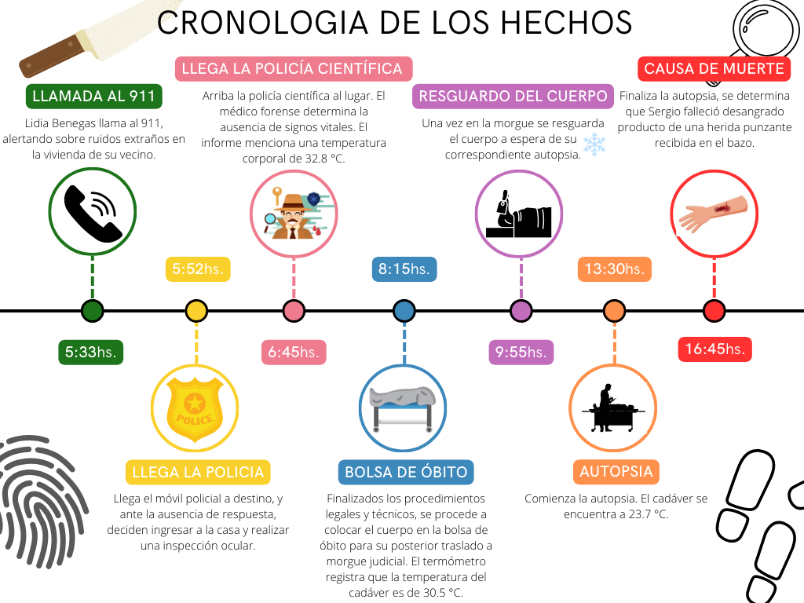

# Introducción

Sumergirse en el mundo de la estadística puede llevarnos a lugares inesperados, desafiando nuestras percepciones y llevándonos a explorar terrenos desconocidos. En esta ocasión, nos sumergimos en un caso peculiar que fusiona el rigor analítico con el misterio de una escena del crimen.

Nuestra historia se centra en Guido, un apasionado estudiante de estadística cuyo amor por la resolución de enigmas lo llevó desde las aulas universitarias hasta las intrigantes calles de Córdoba.

Sin embargo, la emoción de seguir su vocación se ve eclipsada por un oscuro suceso. En una madrugada envuelta en sombras, la unidad de trabajo de Guido es convocada de manera urgente para investigar un crimen recién perpetrado en Salsipuedes. 

En medio del desorden, muebles destrozados, utensilios de cocina esparcidos y, en el centro de todo, el cuerpo inerte de Sergio Contreras, bañado en un charco de sangre. Ante esta escena, Guido se enfrenta a un desafío crucial: determinar la hora en que se produjo la muerte.


# Objetivos

El objetivo principal de este informe es utilizar métodos estadísticos con enfoque bayesiano para estimar con precisión la hora de muerte de Sergio Contreras. A través del estudio de la temperatura corporal postmortem y la aplicación de modelos lineales, buscaremos proporcionar una estimación confiable del momento en que ocurrió el deceso. Además, nuestro objetivo secundario es presentar los resultados de manera clara y concisa, demostrando un dominio completo del contenido y garantizando así la obtención de una calificación sobresaliente (10😉) en la evaluación del informe.

# Metodología

A través del análisis de la temperatura corporal, ecuaciones diferenciales y conceptos matemáticos podremos descifrar el objetivo planteado. 

Sabemos que la temperatura del cuerpo de Segio satisface la siguiente ley:
 $$\frac{dT(t)}{dt}=r[T_{amb}-T(t)]$$
donde:

 * $T_{amb}$ es la temperatura ambiente (un valor fijo y conocido), 
 
 * $r$ es una constante y 
 
 * $T(t)$ es la función (en principio desconocida) que describe la temperatura del cuerpo en función del tiempo.

Se puede demostrar que Una función que satisface esa ecuación es $T(t)=T_{amb}+(T_i-T_{amb})e^{-rt}$
 
$$\frac{dT(t)}{dt}=\frac{d}{dt}(T(t)=T_{amb}+(T_i-T_{amb})e^{-rt})=$$
$$=(T_i-T_{amb})e^{-rt}(-r)=-r(T_i-T_{amb})e^{-rt}=$$
$$=-r(T_i-T_{amb})e^{-rt}+rT_{amb}-rT_{amb}=$$
$$=-r[(T_i-T_{amb})e^{-rt}+T_{amb}]+rT_{amb}=$$

$$=-r[T(t)-T_{amb}]=r[T_{amb}-T(t)]$$
donde:

 * $T_i$ la temperatura a la que está inicialmente el cuerpo de Sergio.
 
# Desarrollo

Para averiguar que indica la constante r, y que valores son coherentes, graficamos la función anterior para distintos valores de $r$, sabiendo que la temperatura del ambiente es $23°C$ y la temperatura al momento de la muerte de Sergio es $37°C$.
```{r, echo=FALSE, error=FALSE, warning=FALSE}
# Carga de paquetes
library(ggplot2)
library(gridExtra)
```

```{r, echo=FALSE, error=FALSE, warning=FALSE}
valores_r = c(-0.1, -0.3, 0, 0.1, 0.3, 1)
temp_desc <- function(valores_r){
  f <- c()
  r <- c()
  t <- seq(0, 24, length.out=200)
  for(i in 1:length(valores_r)){
    f <- c(f, 23+14*exp(-valores_r[i]*t))  
    r <- c(r,rep(valores_r[i], time = 200))
  }
  df <- data.frame(f, tiempos = rep(t, time = length(r)), r=factor(r))
  
g1 <- ggplot(data = df) +
  aes(x = tiempos, y = f, color = r) +
  geom_line() +
  ylim(c(20, 60)) +
  scale_x_continuous(breaks = 0:24) +
  labs(
    x = "Hora post mortem", 
    y = "Temperatura corporal",
    caption = "Gráfico 1: Temperatura corporal post mortem para distintos valores de r"
  ) +
  scale_color_manual(
    values = c("#BF0404", "#010326", "#0D0D0D", "#717362", "#7d721a", "#8C2E2E")
  ) +
  #theme_minimal() +  # Utilizar un tema minimalista para una apariencia más limpia
  theme(
    plot.caption = element_text(hjust = 0.5)
  )
  
  g1
}
temp_desc(valores_r)
```
Sabemos que la temperatura corporal eventualmente alcanza el equilibrio térmico con el ambiente, por lo que no desciende más de $23°C$. Además, al observar los gráficos, se puede deducir que $r$ representa la rapidez con la que la temperatura corporal disminuye hasta igualarse con la del entorno. Por este motivo, el valor de $r$ no puede ser negativo, ya que en estos casos la temperatura aumenta y no es coherente en este problema.

En general, durante las primeras 12 horas post mortem, la temperatura corporal suele disminuir a un ritmo de 0,5 a 1°C por hora. Luego de este período, la tasa de enfriamiento se vuelve más lenta, aproximándose a la temperatura ambiente en aproximadamente 24 horas.

Por lo tanto, llegamos a la conclusión de que $0.1$ es un valor lógico para $r$, ya que en las primeras 12 horas, vemos una disminución de aproximadamente $0.8°C$ por hora en la temperatura corporal.
 
 
Para responder nuestro objetivo tendremos en cuenta las siguientes consideraciones:
En lugar de considerar la temperatura del cuerpo, se considerará la diferencia entre la temperatura del cuerpo y la temperatura ambiente $(T-T_{amb})$. Además, se llamará $T_{diff}$ a la diferencia entre la temperatura inicial del cuerpo y la temperatura ambiente $(T_i-T_{amb})$.

$$T(t)-T_{amb}=T_{diff}e^{-rt}$$

Para linealizar la ecuación aplicamos logaritmo natural a nuestra nueva variables $T(t)-T_{amb}$
$$ln(T(t)-T_{amb})=ln(T_{diff})-rt$$
Mostramos esto graficamente utilizando $r = 0.1$:
```{r}
r = 0.1
t <- seq(0, 24, length.out=200)
f <- 14*exp(-r*t)
ln_f <- log(f)
df2 <- data.frame(f = c(f,ln_f),t =c(t,t), funcion = rep(c("f", "ln_f"), each = 200))
g4 <- ggplot(data = df2) +
  aes(x = t, y = f, color = funcion) +
  geom_line() +
  labs(
    x = "Hora post mortem", 
    y = expression(T(t) - T[amb]),  # Usar expression para incluir la expresión matemática
    caption = expression("Gráfico 2: Comparación de las funciones " * T(t) - T[amb] * " y " * log(T(t) - T[amb])),
    color = "Función"  # Cambia el título de la leyenda a mayúsculas
  ) +
  scale_color_manual(
    values = c("#B10504", "#47421E"),
    labels = c(expression(T(t) - T[amb]), expression(log(T(t) - T[amb])))
  ) +
  #theme_minimal() +  # Utilizar un tema minimalista para una apariencia más limpia
  theme(
    plot.caption = element_text(hjust = 0.5),
    legend.title = element_text(face = "bold"),  # Poner el título de la leyenda en negrita
    legend.text = element_text(size = 10)        # Ajustar el tamaño del texto de la leyenda
  )
g4
```
 
 El intercepto de la función logaritmo de $T(t)-T_{amb}$ es $ln(T_{diff})=2.639$ , lo que indica que la diferencia entre la temperatura corporal y la temperatura ambiente en el momento de la muerte es $e^{2.639}°C=14°C$. La pendiente es $-r=-0.1$, esto significa que a medida que aumenta una hora, el logaritmo de la diferencia entre la temperatura corporal y la temperatura ambiente disminuye en $0.1°C$.
 
Para resolver nuestro objetivo proponemos ajustar un modelo lineal normal, en el que tomaremos como variable explicativa el tiempo.
A continuación se presentan los hechos transcurridos en la noche del fallecimiento de Sergio para ingresar estos datos en el modelo.



 Modelo:

 $Y_i| \beta_0, \beta_1, \sigma \sim N (\mu_i, \sigma)$
 $\mu_i = \beta_0 + \beta_1t $
 $\beta_0 \sim N(\mu=2.5, \sigma=2)$
 $\beta_1 \sim N(\mu=-0.1, \sigma=0.1)$
 $\sigma \sim N^+ (\theta=2.5)$
 
Hacemos el supuesto de que los parámetros son independientes, por lo que podemos postular un prior marginal para cada uno.
Basandonos en los priors mencionados y el supuesto de que los parametros, podemos obtener la distribución predictiva a priori a través de muestras
 
```{r}
muestras_bo = rnorm(100,2.5, 2)
muestras_b1 = rnorm(100,-0.1, 0.1)
sigma = abs(rnorm(100,0,2.5))
mu=muestras_bo + muestras_b1*t


df= data.frame(muestras_bo,muestras_b1,sigma,mu)
df$y_pred = rnorm(5000,df$mu,df$sigma)

# Crear un rango para t
t <- seq(from = -100, to = 100, length.out = 10000)

g <- ggplot() +
  labs(
    x = expression("Tiempo (" * T[i] * ")"),
    y = expression(T(t) - T[amb]),
    caption = expression("Gráfico 3: pruebas predictivas a priori")
  ) +
  geom_abline(intercept = muestras_bo, slope = muestras_b1, alpha = 0.1, color = "gray3") +
  coord_cartesian(xlim = c(-100, 100), ylim = c(-50, 50))+  # Ajustar los límites de los ejes
 theme(plot.caption = element_text(hjust = 0.5))
# Mostrar el gráfico
print(g)

```
 
 